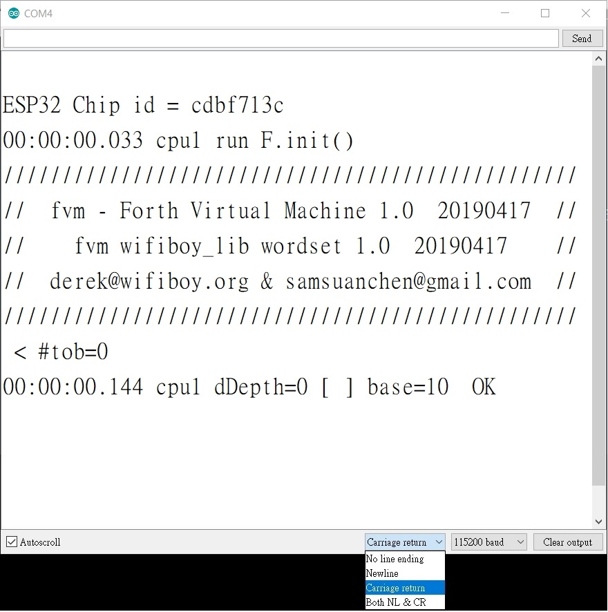
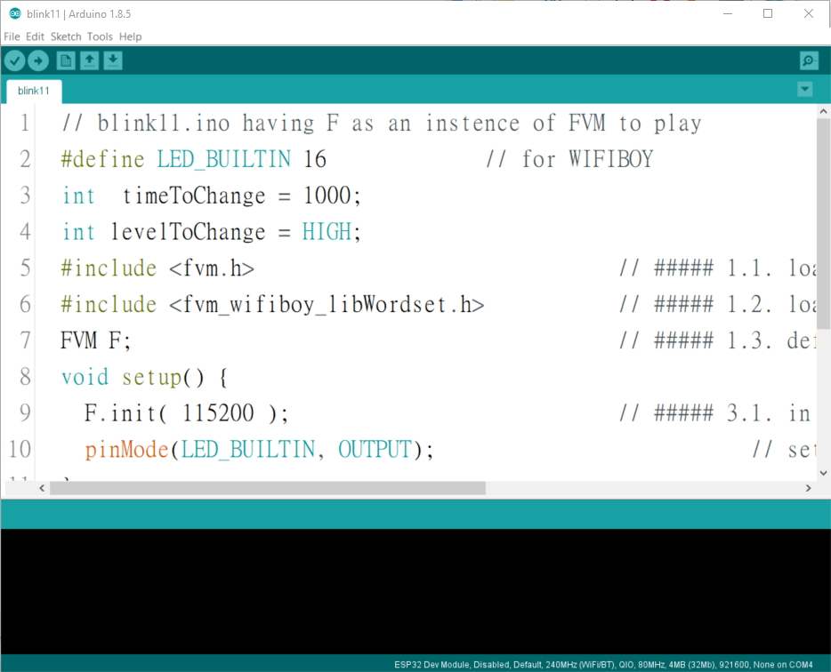

# 為 Arduino 開一個 自我監控檢視的 通道
derek@wifiboy.org & lu.albert@gmail.com & samsuanchen@gmail.com

在 esp32 開發板, 例如 WiFiBoy classic (正反面如下二圖), 我們提供 一系列 簡單 blink 範例 (皆使 開發板的 led 燈 持續 亮 1 秒 滅 1 秒), 
以逐步展示 如何為 Arduino 原 blink 程式同步開啟一個 可以自我監控檢視的 通道。

 

這自我監控檢視的 機制, 就是可以在 Arduino 原 blink 程式中, 同步啟動 本文所提供的 FVM 機制 (virtual monitor)。
在原程式執行同時, 接受另外定義的指令 進行 檢視、監控、測試、 ... 等工作,  或 直接改變 程式 執行狀態 與 效果。

首先, 在所提供的 fvm-blinkxx 資料夾 中 有 fvm 與 wifiboy_lib 兩個子目錄, 以及 fvm_0wordset、fvm_7wordset、fvm_wifiboy_libWordset
三個指令集, 請先 複製 這些子目錄 到 Arduino user 的 libraries 工作子目錄。
例如 其在 windows 通常可能的 路徑是:

		C:\Users\userName\Documents\Arduino\libraries

 請自行替換其中 userName 為 使用者的正確名字。

在 blinkxx 資料夾中剩下的 8 個 子目錄如下, 每個 子目錄中 各有一個 blink 的範例 (依編號增加其複雜度):

		blink00, blink01, blink02, blink03,
		blink10, blink11, blink12, blink13,

## blink00 範例 

		// blink00.ino the Arduino basic blink
		#define LED_BUILTIN 16            // for WIFIBOY
		void setup() {
		  pinMode(LED_BUILTIN, OUTPUT);   // set led pin as output
		}
		void loop() {
		  digitalWrite(LED_BUILTIN, HIGH);// set led pin level as HIGH
		  delay(1000);                    // wait a second
		  digitalWrite(LED_BUILTIN, LOW); // set led pin level as LOW
		  delay(1000);                    // wait a second
		}

在 blink00 子目錄 中的 blink00.ino, 其實就是原 Arduino Basic Blink 範例, 只是我們多加了如下一行, 以宣告 led 的 GPIO pin 腳 號碼為 16。

		#define LED_BUILTIN 16 // for WIFIBOY

## blink01 範例 

		// blink01.ino having F as an instence of FVM to play
		#define LED_BUILTIN 16           // for WIFIBOY
		#include <fvm.h>                            // ##### 1.1. load FVM class, the Forth virtual machine
		#include <fvm_wifiboy_libWordset.h>         // ##### 1.2. load wordset for FVM
		FVM F;                                      // ##### 1.3. define F as an instence of FVM
		void setup() {
		F.init( 115200 );                           // ##### 3.1. in setup(), initialize F
		pinMode(LED_BUILTIN, OUTPUT);    // set led pin as output
		}
		void loop() {
		digitalWrite(LED_BUILTIN, HIGH); // set led pin level as HIGH
		delay(1000);                     // wait a second
		digitalWrite(LED_BUILTIN, LOW);  // set led pin level as LOW
		delay(1000);                     // wait a second
		}

在 blink01 子目錄 中的 blink01.ino, 其實就只在原 blink00.ino 中多加幾行, 就可啟動 FVM 機制了。

1. 在原 blink00.ino 的 setup() 前, 加如下三行, 讓程式 載入 FVM 機制 與 事先定義的指令集:

		#include <fvm.h>                            // ##### 1.1. load FVM class, the Forth virtual machine
		#include <fvm_wifiboy_libWordset.h>         // ##### 1.2. load wordset for FVM
		FVM F;                                      // ##### 1.3. define F as an instence of FVM

2. 在原 blink00.ino 的 setup() 中, 多加如下 1 行, 讓程式 啟動 FVM 機制:

		F.init( 115200 );                           // ##### 3.1. in setup(), initialize F

一旦 啟動了 FVM 機制, 在 閃 led 同時, 我們就可以打開 Arduino IDE 的 Serial Monitor。

 

請注意! 首次啟動 Serial Monitor 時, 記得其下緣需要點選「Carriage return」的選項。
然後, 逐行 反白複製 下列指令, 貼入上方 input box 中, 點 右側 Send 按鈕, 就會: 關 led 燈、開屏幕背光、讓蜂鳴器發 C4 音、再多發 E4 與 A4 兩個音、讓蜂鳴器靜音、
讓屏幕顯示一張照片 維持 1 秒鐘 然後關閉屏幕 (每行將隨後詳加說明)。

		16 input ( turn off led )
		27 output 27 high ( turn on screen back light )
		25 17 buzzerSetup buzzerOn 261.6 HZ ( hum buzzer tone C4 )
		329.6 HZ 1000 ms 440.0 HZ ( hum tone E4 1000 ms then A4 )
		0 HZ ( turn off buzzer )
		wb_init 0 0 128 160 img wb_drawImage 1000 ms 27 low ( show image 1000 ms )

第一行: 「16 input」 將 led pin 腳 (GPIO 16) 的 pin mode 原為 OUTPUT 改為 INPUT, 這樣 led 就不再亮了。 之後以空白區隔的左括號「(」是
註解指令, 忽略 隨後直到 以空白區隔的右括號「)」為止所有文字, 當作註解給人看。 註: FVM 會將 輸入格中的所有文字
依序以 空白 (white space) 區隔出 一個一個不含空白的 字串 (token)。 如果 字串 是某個 指令的名稱 (可為任何文數字以及符號甚至中文), 就執行
所定義給該指令 要執行的工作。 如果 字串 是 數字 (整數 或 浮點數) 就 放到 資料推疊 備用。 如果 既不是 指令的名稱 又不是 數字 就顯示 錯誤訊息。

第二行: 「27 output」 將 屏幕背光 pin 腳 (GPIO 27) 的 pin mode 設為 OUTPUT, 「27 high」 將該 pin 腳電位設為 HIGH, 這樣屏幕背光就亮了。

第三行: 「25 17 buzzerSetup」 指定 GPIO 25 與 GPIO 17 為 蜂鳴器 的 發聲 pin 腳 與 開關控制 pin 腳,「buzzerOn」打開 蜂鳴器,
「261.6 HZ」使 蜂鳴器 發出 261.6 HZ 頻率, 這是鋼琴中央 C (也就是 C4) 的標準音。

第四行: 「329.6 HZ」使 蜂鳴器 發出 329.6 HZ 頻率 (E4 的標準音),「1000 ms」使聲音維持 1 秒,「440.0 HZ」使 蜂鳴器 
發出 440.0 HZ 頻率 (A4 標準音)。

第五行: 「0 HZ」使 蜂鳴器 靜音。

第六行: 「wb_init」 啟動 wifiboy 屏幕繪圖, 「0 0 128 160 img wb_drawImage」在屏幕 0,0 位置 畫出 存放在 img 的影像 寬 128 高 160 的照片。
「1000 ms」使影像顯示維持 1 秒。
「27 low」 將屏幕背光 pin 腳 電位設為 LOW, 關閉 屏幕背光, 影像就不見了。

我們之所以能用到這些指令, 是因為 blink01.ino 中, 我們藉 #include <fvm_wifiboy_libWordset.h> 載入了 事先定義好的指令集。

## blink02 範例 

		// blink02.ino having 3 control variables to test
		#define LED_BUILTIN 16           // for WIFIBOY
		int  led          = LED_BUILTIN; // led pin GPIO number
		int  delayHIGH    = 1000;        // delay period keeping led pin level HIGH
		int  delayLOW     = 1000;        // delay period keeping led pin level LOW
		#include <fvm.h>                                  // ##### 1.1. load FVM class, the Forth virtual machine
		#include <fvm_7Wordset.h>                         // ##### 1.2. load wordset for FVM
		FVM F;                                            // ##### 1.3. define F as an instence of FVM
		void setup() {
		  F.init( 115200 );                               // ##### 3.1. in setup(), initialize F 
		  F.newVariable( "delayHIGH", &delayHIGH );       // ##### 4.1. add address as new constant word delayHIGH in F
		  F.newVariable( "delayLOW" , &delayLOW  );       // ##### 4.2. add address as new constant word delayLOW  in F
		  F.newVariable( "led"      , &led       );       // ##### 4.3. add address as new constant word led       in F
		  pinMode(led, OUTPUT);          // set led pin as output
		}
		void loop() {
		  digitalWrite(led, HIGH);       // set led pin level as HIGH
		  delay(delayHIGH);              // wait a second
		  digitalWrite(led, LOW);        // set led pin level as LOW
		  delay(delayLOW);               // wait a second
		}

這範例 主要是希望將 blink01.ino 中的常數 以 led, delayHIGH, delayLOW 這三個控制變數 來 取代, 以便 在不改變原程式執行流程下 進行監控。
為了這樣簡單的監控, 其實我們並不需要 #include <fvm_wifiboy_libWordset.h> 載入那麼多事先定義的指令。在此, 我們可以試用一個精簡版的指令集。
改用 #include <fvm_7wordset.h> 只載入 7 個所需指令 (當然, 在這樣的形況下, 若要執行沒有載入的指令, 是會出現錯誤訊息的)。
接著, 在 blink01.ino 中多加幾行, 就可 利用 所載入的 驚嘆號 指令 來直接改變 這些控制變數的 值 (隨後詳加說明)。

1. 在原 blink01.ino 的 #include <fvm.h> 前, 多加如下 3 行, 宣告 led, delayHIGH, delayLOW 為 3 個可讓 FVM 監控的 變數 以及 預設值:

		int  led          = LED_BUILTIN; // led pin GPIO number
		int  delayHIGH    = 1000;        // delay period keeping led pin level HIGH
		int  delayLOW     = 1000;        // delay period keeping led pin level LOW

2. 以 led, delayHIGH, 與 delayLOW 三個 控制變數 分別取代原來 blink01.ino 中所對應的常數 LED_BUILTIN, 1000, 1000。

3. 在原 blink01.ino 的 F.init() 之後, 多加如下 3 行, 讓 這三個 控制變數 的名稱 各自代表 其記憶體位址:

		F.newVariable( "delayHIGH", &delayHIGH );		// ##### 4.1. add address as new constant word delayHIGH in F
		F.newVariable( "delayLOW" , &delayLOW  );		// ##### 4.2. add address as new constant word delayLOW  in F
		F.newVariable( "led"      , &led       );		// ##### 4.3. add address as new constant word led       in F

一旦這樣, 程式啟動後, 在 閃 led 同時, 我們打開 Arduino IDE 的 Serial Monitor,
就可以將下列指令, 逐行 反白 複製, 貼入 input box 中來執行, 讓 led 每秒短暫閃亮、讓 led 快閃、讓蜂鳴器滴答響、讓蜂鳴器靜音。

		50 delayLOW ! ( flash per second )
		50 delayHIGH ! ( quick flash )
		25 led ! 25 output 17 output 17 high ( buzzer clicking )
		25 input ( turn of buzzer )

第一行: 「50 delayLOW !」 其中的 驚嘆號 是一個事先定義的 指令, 讀作 store, 將所給值存入控制變數。 因此 這行 是將 delayLOW
這變數中原為 1000 的值 改為 50, 
將 led pin 腳 維持 LOW 電位 (led 亮) 的時間 改為 50 ms。 如此就使 led 每秒短暫閃亮了。

第二行: 「50 delayHIGH !」 就是將 50 設為 delayHIGH 這控制變數的 值 (原來的值 1000), 將 led pin 腳 維持 HIGH 電位 (led 滅) 的時間
也改為 50 ms。 這樣就使 led 快閃了。

第三行: 「25 led !」 也就是將 25 設為 led 這控制變數的 值 (原來的值 16), 將 GPIO 25 (蜂鳴器 的 發聲 pin 腳) 當作 程式中 led 的電位輸出 pin 腳,
「25 output」設定 蜂鳴器 的 發聲 pin 腳 為 輸出,「17 output」設定 蜂鳴器 的 開關控制 pin 腳 為 輸出, 「17 high」將 蜂鳴器 打開。
這樣就讓蜂鳴器 滴答作響了。

第四行: 「25 input」設定 蜂鳴器 的 發聲 pin 腳 為 輸入。這樣 蜂鳴器 就靜音了。

## blink03 範例

		// blink03.ino having new words to execute
		#define LED_BUILTIN 16          // for WIFIBOY
		int led          = LED_BUILTIN; // led pin GPIO number
		int delayHIGH    = 1000;        // delay period keep keeping led pin level HIGH
		int delayLOW     = 1000;        // delay period keep keeping led pin level LOW
		#include <fvm.h>                                  // ##### 1.1. load FVM class, the Forth virtual machine
		#include <fvm_0Wordset.h>                         // ##### 1.2. load wordset for FVM
		FVM F;                                            // ##### 1.3. define F as an instence of FVM
		void setDelayHIGH() { delayHIGH=F.dPop(); }       // ##### 2.1. define the function setDelayHIGH
		void setDelayLOW()  { delayLOW =F.dPop(); }       // ##### 2.2. define the function setDelayLOW
		void setLed()       { led      =F.dPop(); }       // ##### 2.3. define the function setLed
		void output() { pinMode(F.dPop(), OUTPUT); }      // ##### 2.4. define the function output
		void input()  { pinMode(F.dPop(),  INPUT); }      // ##### 2.5. define the function input
		void high()  { digitalWrite(F.dPop(), HIGH); }    // ##### 2.6. define the function high
		void low()   { digitalWrite(F.dPop(),  LOW); }    // ##### 2.7. define the function low
		void paren() { F.parseToken(')'); }               // ##### 2.8. define the function paren
		void setup() {
		  F.init( 115200 );                               // ##### 3.1. in setup(), initialize F
		  F.newPrimitive( "setDelayHIGH", setDelayHIGH ); // ##### 4.1. add new primitive word setDelayHIGH in F
		  F.newPrimitive( "setDelayLOW",  setDelayLOW  ); // ##### 4.2. add new primitive word setDelayLOW  in F
		  F.newPrimitive( "setLed"     ,  setLed       ); // ##### 4.3. add new primitive word setLed       in F
		  F.newPrimitive( "output"     ,  output       ); // ##### 4.3. add new primitive word output       in F
		  F.newPrimitive(  "input"     ,   input       ); // ##### 4.3. add new primitive word  input       in F
		  F.newPrimitive(   "high"     ,    high       ); // ##### 4.3. add new primitive word   high       in F
		  F.newPrimitive(    "low"     ,     low       ); // ##### 4.3. add new primitive word    low       in F
		  F.newPrimitive( "(",  "paren",   paren       ); // ##### 4.8. add new primitive word      (       in F
		  pinMode(led, OUTPUT);	       // set led pin as output
		}
		void loop() {
		  digitalWrite(led, HIGH);     // set led pin level as HIGH
		  delay(delayHIGH);            // wait a second
		  digitalWrite(led, LOW);      // set led pin level as LOW
		  delay(delayLOW);             // wait a second
		}

這範例 藉 #include <fvm_0Wordset.h> 不載入任何事先定義的指令集。 我們可直接定義 自己的新指令, 以執行相關 控制功能。
此例特別針對 原來 blink02.ino 中的三個 控制變數 (delayHIGH, delayLOW, led), 分別定義各自的 執行指令 來 設定其值。
這樣或許比較可以確保系統安全, 不讓 FVM 用 驚嘆號指令 直接設定 記憶體 內容,
改由自己定義的 Arduino fuctions 來設定 控制變數 的值。另外, 我們也自行定義了 4 個所需的 IO 指令 以及 右括號 註解指令。

1. 在原來 blink02.ino 的 setup() 前, 定義 Arduino functions, 用以 改變 led 維持 亮/滅 的 時間, led pin 腳 的 GPIO 編號,
設定 pin 腳的 輸入 或 輸出 mode, 設定 pin 腳的 電位, 以及 忽略當作註解的文字。

		void setDelayHIGH() { delayHIGH=F.dPop(); }       // ##### 2.1. define the function setDelayHIGH
		void setDelayLOW()  { delayLOW =F.dPop(); }       // ##### 2.2. define the function setDelayLOW
		void setLed()       { led      =F.dPop(); }       // ##### 2.3. define the function setLed
		void output() { pinMode(F.dPop(), OUTPUT); }      // ##### 2.4. define the function output
		void input()  { pinMode(F.dPop(),  INPUT); }      // ##### 2.5. define the function input
		void high()  { digitalWrite(F.dPop(), HIGH); }    // ##### 2.6. define the function high
		void low()   { digitalWrite(F.dPop(),  LOW); }    // ##### 2.7. define the function low
		void paren() { F.parseToken(')'); }               // ##### 2.8. define the function paren

     在 這些 function 中, 我們 用 F.dPop() 從 資料推疊 (data stack) 取得 執行該 function 所需的資料。 

2. 在原來 blink02.ino 的 setup() 中, 以 newPrimitiv() 取代 newVariable(), 來定義 3 個設定變數值的 新指令, 4 個 IO 指令,
以及 註解指令。 分別以 指令名稱 去執行 所對應的 Arduino function。
請注意! FVM 所用的 指令名稱 若不同於 其要執行的 Arduino function 名稱, 這兩個名稱字串 都需要當作 newPrimitiv() 的參數。

		F.newPrimitive( "setDelayHIGH", setDelayHIGH );    // ##### 4.1. add new primitive word setDelayHIGH in F
		F.newPrimitive( "setDelayLOW",  setDelayLOW  );    // ##### 4.2. add new primitive word setDelayLOW  in F
		F.newPrimitive( "setLed"     ,  setLed       );    // ##### 4.3. add new primitive word setLed       in F
		F.newPrimitive( "output"     ,  output       );    // ##### 4.3. add new primitive word output       in F
		F.newPrimitive(  "input"     ,   input       );    // ##### 4.3. add new primitive word  input       in F
		F.newPrimitive(   "high"     ,    high       );    // ##### 4.3. add new primitive word   high       in F
		F.newPrimitive(    "low"     ,     low       );    // ##### 4.3. add new primitive word    low       in F
		F.newPrimitive( "(",  "paren",   paren       );    // ##### 4.8. add new primitive word      (       in F

一旦這樣, 程式啟動後, 在 閃 led 同時, 我們打開 Arduino IDE 的 Serial Monitor
從 輸入格 中, 就可逐行輸入下列指令, 一樣可 讓 led 每秒短暫閃亮、讓 led 快閃、讓蜂鳴器滴答響、讓蜂鳴器靜音。

		50 setDelayLOW ( flash per second )
		50 setDelayHIGH ( quick flash )
		25 setLed 25 output 17 output 17 high ( buzzer clicking )
		25 input ( turn of buzzer )

第一行: 「50 setDelayLOW」 將 50 設為 delayLOW 這控制變數的 值 (原來的值 1000), 
將 led pin 腳 維持 LOW 電位 (led 亮) 的 時間 改為 50 ms。 這樣就讓 led 每秒短暫閃亮了。

第二行: 「50 setDelayHIGH」 將 50 設為 delayHIGH 這控制變數的 值 (原來的值 1000), 將 led pin 腳 維持 HIGH 電位 (led 滅) 
的 時間 也改為 50 ms。
這樣就讓 led 快速閃亮了。

第三行: 「25 setLed」 將 25 設為 led 這控制變數的 值 (原來的值 16), 將 GPIO 25 (蜂鳴器 的 發聲腳) 當作 程式中 led 的電位輸出腳,
「25 output」設定 蜂鳴器 的 發聲腳 為 輸出,「17 output」設定 蜂鳴器 的 開關腳 為 輸出, 「17 high」將 蜂鳴器 打開。
這樣就讓蜂鳴器 滴答作響了。

第四行: 「25 input」設定 蜂鳴器 的 發聲腳 為 輸入。這樣 蜂鳴器 的 發聲腳 無法輸出, 就使 蜂鳴器 靜音了。

## blink10 範例

		// blink10.ino not using delay() to keep led pin level LOW/HIGH
		#define LED_BUILTIN 16                      // for WIFIBOY
		int  timeToChange = 1000;                   // time to change
		int levelToChange = HIGH;                   // level to change
		void setup() {
		  pinMode(LED_BUILTIN, OUTPUT);             // set led pin as output level become LOW)
		}
		void loop() {
		  if( millis() < timeToChange ) return;     // wait until time to change
		  digitalWrite(LED_BUILTIN, levelToChange );// set led pin level
		  timeToChange += 1000;                     // set next time to change
		  levelToChange = HIGH - levelToChange;     // set next level to change
		}

這範例 改變了原來 blink00.ino 的程式設計邏輯, 在 loop() 子程式中, 不用 delay() 來維持 亮/滅 時間, 改以 millis() 檢視時間,
直到 指定時間 才改變 亮/滅 並 設定下一個指定時間。 這樣的設計 可讓我們有機會 善用 等待時間 不耽誤 在 loop() 中可能增加的其他重要工作。
在這程式中, 我們用了 timeToChange 與 levelToChange 這兩個變數, 記住 何時要改變 led 的 pin 腳 電位, 以及要改變為 怎樣的 輸出電位。

## blink11 範例

		// blink11.ino having F as an instence of FVM to play
		#define LED_BUILTIN 16					  // for WIFIBOY
		int  timeToChange = 1000;				  // time to change
		int levelToChange = HIGH;				  // level to change
		#include <fvm.h>                                        // ##### 1.1. load FVM class, the Forth virtual machine
		#include <fvm_wifiboy_libWordset.h>                     // ##### 1.2. load wordset for FVM
		FVM F;                                                  // ##### 1.3. define F as an instence of FVM
		void setup() {
		  F.init( 115200 );                       		// ##### 3.1. in setup(), initialize F
		  pinMode(LED_BUILTIN, OUTPUT);                           // set led pin as output level become LOW)
		}
		void loop() {
		  if( millis() < timeToChange ) return;                   // wait until time to change
		  digitalWrite( LED_BUILTIN, levelToChange );             // set led pin level
		  timeToChange += 1000;   				  // set next time to change
		  levelToChange = HIGH - levelToChange;                   // set next level to change
		}

這範例 類似 blink01。主要是希望藉以複習: 如何可以將 這改寫的 blink10 程式 加幾行 也就啟動了 FVM 機制。

1. 在原來 blink10.ino 的 setup() 前, 加如下三行, 讓程式 載入 FVM 機制:

		#include <fvm.h>                                        // ##### 1.1. load FVM class, the Forth virtual machine
		#include <fvm_wifiboy_libWordset.h>                     // ##### 1.2. load wordset for FVM
		FVM F;                                                  // ##### 1.3. define F as an instence of FVM

2. 在原來 blink10.ino 的 setup() 中, 多加如下一行, 讓程式 啟動 FVM 機制:

		F.init( 115200 );                       		// ##### 3.1. in setup(), initialize F

一旦 啟動了 FVM 機制, 像 blink01 一樣, 在 閃 led 同時, 我們就可以打開 Arduino IDE 的 Serial Monitor。
從其 input box 中, 可逐行輸入下列指令, 以關 led 燈、開屏幕背光、讓蜂鳴器發 C4 音、再多發 E4 與 A4 兩個音、讓蜂鳴器靜音、
讓屏幕顯示一張照片 維持 1 秒鐘 然後關閉屏幕 (隨後分別詳加說明)。

		16 input ( turn off led )
		27 output 27 high ( turn on screen back light )
		25 17 buzzerSetup buzzerOn 261.6 HZ ( hum buzzer tone C4 )
		329.6 HZ 1000 ms 440.0 HZ ( hum tone E4 1000 ms then A4 )
		0 HZ ( turn off buzzer )
		wb_init 0 0 128 160 img wb_drawImage 1000 ms 27 low ( show image 1000 ms )

第一行: 「16 input」 將 led pin 腳 (GPIO 16) 的 pin mode 原為 OUTPUT 改為 INPUT, 這樣 led 就不再亮了。

第二行: 「27 output」 將 屏幕背光 pin 腳 (GPIO 27) 的 pin mode 設為 OUTPUT, 「27 high」 將該 pin 腳電位設為 HIGH, 這樣屏幕背光就亮了。

第三行: 「25 17 buzzerSetup」 指定 GPIO 25 與 GPIO 17 為 蜂鳴器 的 發聲 pin 腳 與 開關控制 pin 腳,「buzzerOn」打開 蜂鳴器,
「261.6 HZ」使 蜂鳴器 發出 261.6 HZ 頻率, 這是鋼琴中央 C (也就是 C4) 的標準音。

第四行: 「329.6 HZ」使 蜂鳴器 發出 329.6 HZ 頻率 (E4 的標準音),「1000 ms」使聲音維持 1 秒,「440.0 HZ」使 蜂鳴器 
發出 440.0 HZ 頻率 (A4 標準音)。

第五行: 「0 HZ」使 蜂鳴器 靜音。

第六行: 「0 0 128 160 img wb_drawImage」 在屏幕 0,0 位置 畫出存放在 img 的影像 寬 128 高 160 的照片。「1000 ms」使影像顯示維持 1 秒。
「27 low」 將屏幕背光 pin 腳 電位設為 LOW, 關閉 屏幕背光, 影像就不見了。

## blink12 範例

	// blink12.ino having 3 control variable to test
	#define LED_BUILTIN 16	                                // for WIFIBOY
	int  timeToChange = 1000;                               // time to change
	int levelToChange = HIGH;                               // level to change
	int  led          = LED_BUILTIN;                        // set GPIO 16 as led pin number
	int  delayHIGH    = 1000;                               // keep 1000 ms for led pin level HIGH
	int  delayLOW     = 1000;                               // keep 1000 ms for led pin level LOW
	#include <fvm.h>                                        // ##### 1.1. load FVM class, the Forth virtual machine
	#include <fvm_7Wordset.h>                               // ##### 1.2. load wordset for FVM
	FVM F;                                                  // ##### 1.3. define F as an instence of FVM
	void setup() {
	  F.init( 115200 );                                     // ##### 3.1. in setup(), initialize F
	  F.newVariable( "delayHIGH", &delayHIGH );             // ##### 4.1. add address as new constant word delayHIGH in F
	  F.newVariable( "delayLOW" , &delayLOW  );             // ##### 4.2. add address as new constant word delayLOW  in F
	  F.newVariable( "led"      , &led       );             // ##### 4.3. add address as new constant word led       in F
	  pinMode(led, OUTPUT);                                 // set led pin as output level become LOW)
	}
	void loop() {
	  if( millis() < timeToChange ) return;                 // wait until time to change
	  digitalWrite( led, levelToChange );                   // set led pin level
	  timeToChange += levelToChange ? delayHIGH : delayLOW; // set next time to change
	  levelToChange = HIGH - levelToChange;                 // set next level to change
	}

這範例 類似 blink02。主要是希望藉以複習: 如何將 blink11 中的常數 以 led, delayHIGH, delayLOW 三個控制變數取代。
在 blink11 中多加幾行, 就可可以利用 驚嘆號指令 來改變這些 控制變數的值。

1. 在 blink11.ino 的 #include <fvm.h> 前, 多加如下 3 行, 宣告 led, delayHIGH, delayLOW 為 3 個控制變數:

		int  led          = LED_BUILTIN;
		int  delayHIGH    = 1000;
		int  delayLOW     = 1000;

2. 以 led, delayHIGH, delayLOW 這三個 控制變數 取代 blink11 中所對應的 常數 (BUILDIN_LED, 1000, 1000)。

3. 在 blink11.ino 的 F.init() 之後, 多加如下 3 行, 讓虛擬監控機制 分別知道 這三個 控制變數 各自的 記憶體位址:

		F.newVariable( "delayHIGH", &delayHIGH );
		F.newVariable( "delayLOW" , &delayLOW  );
		F.newVariable( "led"      , &led       );

一旦這樣, 程式啟動後, 在 閃 led 同時, 我們打開 Arduino IDE 的 Serial Monitor,
就可以將下列指令, 逐行 反白 複製, 貼入 input box 中來執行, 讓 led 每秒短暫閃亮、讓 led 快閃、讓蜂鳴器滴答響、讓蜂鳴器靜音 (隨後分別詳加說明)。

		50 delayLOW ! ( flash per second )
		50 delayHIGH ! ( quick flash )
		25 led ! 25 output 17 output 17 high ( buzzer clicking )
		25 input ( turn of buzzer )

第一行: 「50 delayLOW !」 其中的 驚嘆號 是一個事先定義的 指令, 讀作 store, 將所給值存入控制變數。 因此 這行 是將 delayLOW
這變數中原為 1000 的值 改為 50, 
將 led pin 腳 維持 LOW 電位 (led 亮) 的時間 改為 50 ms。 如此就使 led 每秒短暫閃亮了。

第二行: 「50 delayHIGH !」 就是將 50 設為 delayHIGH 這控制變數的 值 (原來的值 1000), 將 led pin 腳 維持 HIGH 電位 (led 滅) 的時間
也改為 50 ms。 這樣就使 led 快閃了。

第三行: 「25 led !」 也就是將 25 設為 led 這控制變數的 值 (原來的值 16), 將 GPIO 25 (蜂鳴器 的 發聲 pin 腳) 當作 程式中 led 的電位輸出 pin 腳,
「25 output」設定 蜂鳴器 的 發聲 pin 腳 為 輸出,「17 output」設定 蜂鳴器 的 開關控制 pin 腳 為 輸出, 「17 high」將 蜂鳴器 打開。
這樣就讓蜂鳴器 滴答作響了。

第四行: 「25 input」設定 蜂鳴器 的 發聲 pin 腳 為 輸入。這樣 蜂鳴器 就靜音了。

## blink13 範例

		// blink13.ino having new words to execute
		#define LED_BUILTIN 16                                  // for WIFIBOY
		int  timeToChange = delayLOW;                           // time to change
		int levelToChange = HIGH;                               // level to change
		int led           = LED_BUILTIN;                        // set GPIO 16 as led pin number
		int delayHIGH     = 1000;                               // keep 1000 ms for led pin level HIGH
		int delayLOW      = 1000;                               // keep 1000 ms for led pin level LOW
		#include <fvm.h>                                        // ##### 1.1. load FVM class, the Forth virtual machine
		#include <fvm_0Wordset.h>                               // ##### 1.2. load no wordset for FVM
		FVM F;                                                  // ##### 1.3. define F as an instence of FVM
		void setDelayHIGH()   { delayHIGH=F.dPop(); }           // ##### 2.1. define the function setDelayHIGH
		void setDelayLOW()    { delayLOW =F.dPop(); }           // ##### 2.2. define the function setDelayLOW
		void setLed()         { led      =F.dPop(); }           // ##### 2.3. define the function setLed
		void output()  { pinMode(F.dPop(), OUTPUT); }           // ##### 2.4. define the function output
		void input()   { pinMode(F.dPop(),  INPUT); }           // ##### 2.5. define the function input
		void high() { digitalWrite(F.dPop(), HIGH); }           // ##### 2.6. define the function high
		void low()  { digitalWrite(F.dPop(),  LOW); }           // ##### 2.7. define the function low
		void paren() { F.parseToken(')'); }                     // ##### 2.8. define the function paren
		void setup() {
		  F.init( 115200 );                                     // ##### 3.1. in setup(), initialize F
		  F.newPrimitive( "setDelayHIGH", setDelayHIGH );       // ##### 4.1. add new primitive word setDelayHIGH in F
		  F.newPrimitive( "setDelayLOW",  setDelayLOW  );       // ##### 4.2. add new primitive word setDelayLOW  in F
		  F.newPrimitive( "setLed"     ,  setLed       );       // ##### 4.3. add new primitive word setLed       in F
		  F.newPrimitive( "output"     ,  output       );       // ##### 4.3. add new primitive word output       in F
		  F.newPrimitive(  "input"     ,   input       );       // ##### 4.3. add new primitive word  input       in F
		  F.newPrimitive(   "high"     ,    high       );       // ##### 4.3. add new primitive word   high       in F
		  F.newPrimitive(    "low"     ,     low       );       // ##### 4.3. add new primitive word    low       in F
		  F.newPrimitive( "(",  "paren",   paren       );       // ##### 4.8. add new primitive word      (       in F
		  pinMode(led, OUTPUT);                                 // set led pin as output level become LOW)
		}
		void loop() {
		  if( millis() < timeToChange ) return;                 // wait until time to change
		  digitalWrite( led, levelToChange );                   // set led pin level
		  timeToChange += levelToChange ? delayHIGH : delayLOW; // set next time to change
		  levelToChange = HIGH - levelToChange;                 // set next level to change
		}

這範例 類似 blink02。主要是希望藉以複習: 如何定義自己的指令, 以自訂指令 改變 控制變數, 以自訂指令 進行 IO 測試。

1. 在原來 blink12 範例, setup() 前, 定義 Arduino functions, 用以 改變 led 維持 亮/滅 的 時間, led pin 腳 的 GPIO 編號, 以及所需 IO 指令。

		void setDelayHIGH() { delayHIGH=F.dPop(); }       // ##### 2.1. define the function setDelayHIGH
		void setDelayLOW()  { delayLOW =F.dPop(); }       // ##### 2.2. define the function setDelayLOW
		void setLed()       { led      =F.dPop(); }       // ##### 2.3. define the function setLed
		void output() { pinMode(F.dPop(), OUTPUT); }      // ##### 2.4. define the function output
		void input()  { pinMode(F.dPop(),  INPUT); }      // ##### 2.5. define the function input
		void high()  { digitalWrite(F.dPop(), HIGH); }    // ##### 2.6. define the function high
		void low()   { digitalWrite(F.dPop(),  LOW); }    // ##### 2.7. define the function low
		void paren() { F.parseToken(')'); }               // ##### 2.8. define the function paren

2. 在原來 blink12 範例, setup() 中, 以 newPrimitiv() 取代 newVariable(), 來定義 3 個設定變數值的 新指令, 以及 4 個 IO 指令。
分別以 指令名稱 去執行 所對應的 Arduino function。

		F.newPrimitive( "setDelayHIGH", setDelayHIGH );    // ##### 4.1. add new primitive word setDelayHIGH in F
		F.newPrimitive( "setDelayLOW",  setDelayLOW  );    // ##### 4.2. add new primitive word setDelayLOW  in F
		F.newPrimitive( "setLed"     ,  setLed       );    // ##### 4.3. add new primitive word setLed       in F
		F.newPrimitive( "output"     ,  output       );    // ##### 4.4. add new primitive word output       in F
		F.newPrimitive(  "input"     ,   input       );    // ##### 4.5. add new primitive word  input       in F
		F.newPrimitive(   "high"     ,    high       );    // ##### 4.6. add new primitive word   high       in F
		F.newPrimitive(    "low"     ,     low       );    // ##### 4.7. add new primitive word    low       in F
		F.newPrimitive( "(",  "paren",   paren       );    // ##### 4.8. add new primitive word      (       in F

一旦這樣, 程式啟動後, 在 閃 led 同時, 我們打開 Arduino IDE 的 Serial Monitor
從 輸入格 中, 就可逐行輸入下列指令, 一樣可 讓 led 每秒短暫閃亮、讓 led 快閃、讓蜂鳴器滴答響、讓蜂鳴器靜音 (隨後分別詳加說明)。

		50 setDelayLOW ( flash per second )
		50 setDelayHIGH ( quick flash )
		25 setLed 25 output 17 output 17 high ( buzzer clicking )
		25 input ( turn of buzzer )

第一行: 「50 setDelayLOW」 將 50 設為 delayLOW 這控制變數的 值 (原來的值 1000), 
將 led pin 腳 維持 LOW 電位 (led 亮) 的 時間 改為 50 ms。 這樣就讓 led 每秒短暫閃亮了。

第二行: 「50 setDelayHIGH」 將 50 設為 delayHIGH 這控制變數的 值 (原來的值 1000), 將 led pin 腳 維持 HIGH 電位 (led 滅) 
的 時間 也改為 50 ms。
這樣就讓 led 快速閃亮了。

第三行: 「25 setLed」 將 25 設為 led 這控制變數的 值 (原來的值 16), 將 GPIO 25 (蜂鳴器 的 發聲腳) 當作 程式中 led 的電位輸出腳,
「25 output」設定 蜂鳴器 的 發聲腳 為 輸出,「17 output」設定 蜂鳴器 的 開關腳 為 輸出, 「17 high」將 蜂鳴器 打開。
這樣就讓蜂鳴器 滴答作響了。

第四行: 「25 input」設定 蜂鳴器 的 發聲腳 為 輸入。這樣 蜂鳴器 的 發聲腳 無法輸出, 就使 蜂鳴器 靜音了。

## 相關準備

### 1. 為 Arduino IDE 安裝 esp32 選項

請參閱 https://wifiboy.club/category/9/wifiboy32-esp32 檢視「如何安裝 Arduino IDE for WiFiBoy32」

### 2. 從 github 取得 fvm-blinkxx 相關資料

	git clone https://github.com/samsuanchen/fvm-blinkxx
	

## FVM 機制 功能 簡要說明

	FVM F				clame F as an instance of FVM.
	F.init(baud)			initialize F with given baud rate.
	F.newPrimitive(name,func)	create new primitive type word of given name to run given function.
	F.newVariable(name,address)	create new variable type word of given name to return given address.
	F.dPop()			pop data as integer from data stack
	F.parseToken(delimiter)		parse string in tib until given delimiter

## 虛擬監控機制 test.txt 範例 引用的指令 簡要說明

	'		( <name> -- w )	find the word of given name
	-		( n1 n2 -- n1-n2 ) subtract n1 by n2
	!		( v a -- ) store value v to address a
	(		ignore string until right parenthesis
	(again)		compile only code for the end of begin-again
			loop construct
	(begin)		compile only code for the begin of begin-again,
			begin-until, or begin-while-repeat loop construct
	(else)		compile only code for the else of if-else-then
			branch construct
	(for)		compile only code for the begin of for-next
			loop construct
	(if)		compile only code for the begin of if-else-then
			branch construct
	(next)		compile only code for the end of for-next
			loop construct
	(repeat)	compile only code for the end of begin-while-repeat 
			loop construct
	(then)		compile only code for the end of if-else-then
			branch construct
	(until)		compile only code for the end of begin-until
			loop construct
	(while)		compile only code for the while of 
			begin-while-repeat loop construct
	,		( n -- ) compile n into high level colon word-list
	.		( n -- ) print n and a space
	.(		print string until right parenthesis
	.id		( w -- ) print the id and name of given word w
	:		create high level definition word of given name
	;		end of high level definition
	?dup		( n -- n n | 0 ) duplicate n if n is not 0
	@		( a -- v ) fetch value v from address a
	=		( n1 n2 -- n1==n2 ) check if n1 equal to n2
	>r		( n -- ) push n onto return stack
	0=		( n -- n==0 ) check if n equal to 0
	1+		( n -- n+1 ) increment n by 1
	2dup		( n1 n2 -- n1 n2 n1 n2 ) duplicate n1 and n2
	cell/		( n -- n/4 ) divide n by 4
	compile		compile the following word in colon definition
	constant	( n -- ) create constant of given name as value n
	context		( -- a ) the variable saving the address of the last word in dictionary
	cr		print carriage return and line feed
	drop		( n -- ) drop n
	dup		( n -- n n ) duplicate n
	exit		exit from high level definition
	for		( n -- ) setup for-next loop to run the words
				before next n+1 times
	here		( -- a ) the address of end of compiled space
	img		( -- a ) the address of a sample image
	immediate	set the last word to be immediate
	last		( -- a ) the variable saving the address of the last word defined (might not in dictionary yet)
	ms		( n -- ) delay n milli seconds
	next		end of for-next loop
	output		( pin -- ) setup given pin as an output device
	over		( n1 n2 -- n1 n2 n1 ) duplicate n1
	r@		( -- n ) duplicate the value n on return stack 
	r>		( -- n ) pop the value n on return stack
	swap		( n1 n2 -- n2 n1 ) swap two values on data stack
	toggle		( pin -- ) toggle HIGH/LOW level of given pin
	wb_drawLine	( x1 y1 x2 y2 color width -- ) 
	wb_drawImage	( x y w h adr -- )
	wb_drawString	( adr x y type size -- )
	wb_init		( -- )
	wb_setTextColor	( color -- )
	wbCYAN		( -- colorCYAN )
	wbRED		( -- colorRED )
	wbWHITE		( -- colorWHITE )
	z"		( -- adr ) the address of string before double quote "
